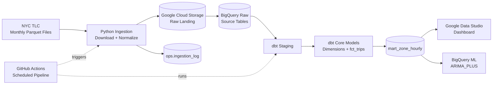
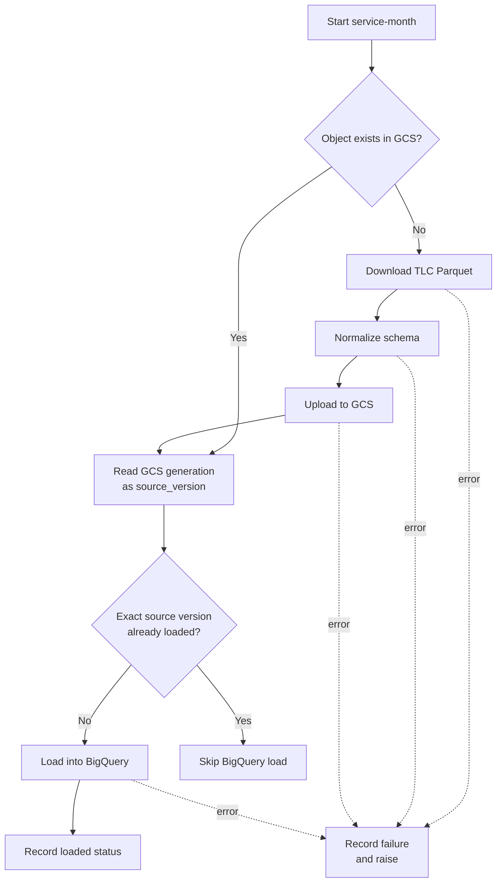
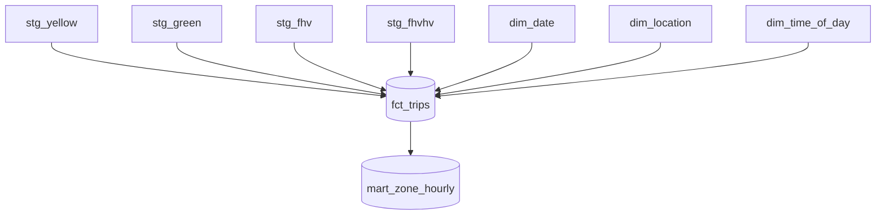
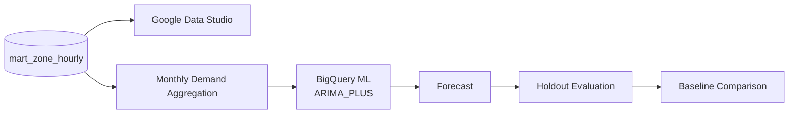

# NYC TLC Analytics Architecture

This file documents how data moves through the project.

## End-to-End Pipeline



## Ingestion Flow



## Warehouse Model



`fct_trips` standardizes the trip sources into a shared trip-level schema.

`mart_zone_hourly` aggregates the fact table to:

```text
pickup_date
× pickup_hour
× trip_type
× pickup_location_id
```

## Analytics and ML



The dashboard uses the hourly zone mart directly.

The forecasting path aggregates the mart to monthly combined demand, trains an `ARIMA_PLUS` model, evaluates it on held-out months, and compares it against last-value and seasonal-naive baselines.

## Reliability Design

The pipeline intentionally treats these as different states:

```text
Object exists in GCS
```

and:

```text
That exact object version loaded successfully into BigQuery
```

`ops.ingestion_log` and the GCS object generation ID are used to track the second state.

This allows a source file that landed successfully but failed during BigQuery loading to be retried instead of being permanently skipped.

## Current Boundaries

- FHVHV is not part of the main comparable analytics path because coverage is incomplete.
- Raw loads use `WRITE_APPEND`, so arbitrary source replacement is not fully idempotent.
- Newly expected TLC files can occasionally fail because of upstream publication/access behavior.
- The current ML model forecasts total monthly demand rather than zone-level demand.
