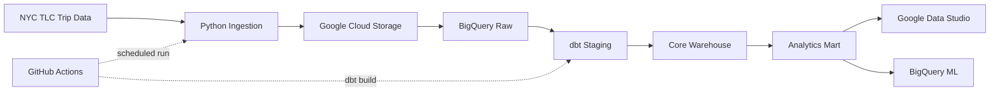
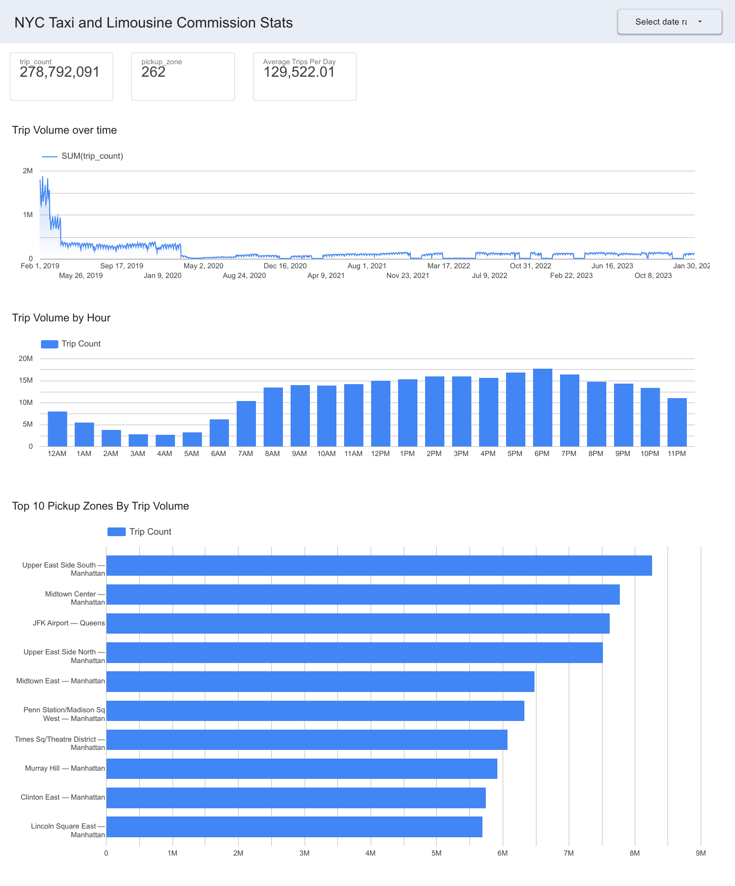

# NYC TLC Analytics Platform

An end-to-end data engineering and analytics project built on NYC Taxi & Limousine Commission (TLC) trip data.

The project ingests public TLC Parquet files, lands them in Google Cloud Storage, loads them into BigQuery, transforms them with dbt, serves an analytics mart for Google Data Studio, and uses BigQuery ML to forecast monthly trip demand.

## Project Highlights

- Built a BigQuery warehouse containing **200M+ trip records**
- Modeled Yellow Taxi, Green Taxi, and For-Hire Vehicle (FHV) data into a shared fact table
- Added dbt tests for nulls, relationships, accepted values, and mart grain
- Built an hourly pickup-zone analytics mart for dashboard queries
- Reduced scan volume for a representative monthly trip-volume query by approximately **93%**
- Built a BigQuery ML `ARIMA_PLUS` demand forecast
- Achieved **5.47% MAPE** across five complete holdout months
- Outperformed both last-value and seasonal-naive forecasting baselines
- Added scheduled ingestion and dbt execution with GitHub Actions
- Added fail-loud ingestion logging, retry behavior, deterministic BigQuery job IDs, and source-version tracking

## Architecture

See [ARCHITECTURE.md](./ARCHITECTURE.md) for the pipeline diagram and component-level explanation.



## Technology Stack

| Layer | Technology |
|---|---|
| Ingestion | Python |
| Object storage | Google Cloud Storage |
| Data warehouse | BigQuery |
| Transformation | dbt |
| Analytics / BI | Google Data Studio |
| Machine learning | BigQuery ML |
| Automation | GitHub Actions |
| File processing | PyArrow / Parquet |

## Data Sources

The project uses public NYC TLC trip record data.

Primary services used in the comparable analytics window:

- Yellow Taxi
- Green Taxi
- For-Hire Vehicle (FHV)

High Volume For-Hire Vehicle (FHVHV) data was also explored, but is excluded from the main cross-service dashboard and forecasting analysis because its historical coverage is incomplete.

## Warehouse Design

### Staging

Source-specific staging models normalize field names and known data-quality issues.

Examples:

- `stg_yellow`
- `stg_green`
- `stg_fhv`
- `stg_fhvhv`

### Dimensions

- `dim_date`
- `dim_location`
- `dim_time_of_day`

### Fact Table

`fct_trips` combines the supported TLC services into a shared trip-level schema.

The model restricts pickup dates to the valid date-dimension range. Trips with valid pickup dates but invalid dropoff dates remain in the fact table with the affected dropoff fields set to `NULL`.

### Analytics Mart

`mart_zone_hourly` aggregates trips to:

```text
pickup_date
× pickup_hour
× trip_type
× pickup_location_id
```

It contains trip volume and aggregate distance, duration, fare, and tip metrics for dashboard queries.

## Data Quality and Reliability

The ingestion layer includes:

- fail-loud BigQuery load errors
- separate GCS-landed and BigQuery-loaded state
- `ops.ingestion_log` status tracking
- deterministic BigQuery load job IDs
- retry-safe handling of already-successful load jobs
- GCS generation IDs recorded as source versions
- numeric schema normalization for incoming Parquet files
- GitHub Actions failure propagation

The project does not claim full source-replacement idempotency. Raw tables currently use `WRITE_APPEND`, so replacing a previously loaded logical month with a new source version can still append duplicate logical data.

## Dashboard

The [live Google Data Studio report](https://datastudio.google.com/reporting/a3d1d7d2-8ee6-4f4b-bd39-a20ae6c6c767) uses `mart_zone_hourly`.



Comparable analysis window:

**March 2019 through February 2024**

Primary visuals:

- Trips over time
- Trips by hour of day
- Top pickup zones by trip volume

Primary scorecards:

- Total trips
- Pickup zones with trips
- Average trips per day

Yellow, Green, and FHV are used for cross-service comparisons. FHVHV is excluded because its historical coverage is incomplete.

## Performance and Cost Validation

A representative monthly trip-volume query was compared against the full fact table and the aggregated mart.

- Fact-table scan: approximately **2.51 GB**
- Mart scan: approximately **168 MB**
- Reduction: approximately **93%**

## BigQuery ML Forecasting

A BigQuery ML `ARIMA_PLUS` model forecasts combined monthly demand for Yellow, Green, and FHV services.

The model was trained through August 2023 and evaluated against later held-out months. The [BigQuery ML SQL](ml/bqml_forecast.sql) includes model creation, the five-month holdout evaluation, and both baselines. Reported metrics reflect the warehouse snapshot used for the original evaluation and may change as source data is refreshed.

December 2023 was excluded from the final evaluation because source-completeness checks showed:

- FHV: 31 days present
- Green: 1 day present
- Yellow: 2 days present

### Model Evaluation

| Model | MAE | RMSE | MAPE |
|---|---:|---:|---:|
| ARIMA_PLUS | 209,210 | 335,238 | **5.47%** |
| Last Value | 229,073 | 360,719 | 6.01% |
| Seasonal Naive | 830,498 | 1,660,543 | 21.30% |

`MAPE` means **Mean Absolute Percentage Error**. A MAPE of 5.47% means the forecast was about 5.47% away from actual demand on average across the five complete holdout months.

## Automation

GitHub Actions runs the ingestion and dbt pipeline on a schedule.

The workflow:

1. Checks out the repository
2. Installs Python and dependencies
3. Configures Google Cloud credentials
4. Runs ingestion
5. Runs `dbt build`
6. Fails visibly if ingestion or transformation fails

One known operational limitation is that newly expected TLC source files can occasionally return upstream access errors.

## Running the Project

Typical local flow:

```bash
cd ingestion
python ingest.py
```

Then:

```bash
cd ../dbt
dbt build --profiles-dir .
```

## Known Limitations

- FHVHV historical coverage is incomplete
- December 2023 Yellow and Green data are incomplete in the current warehouse
- Upstream TLC publication/access timing can affect scheduled ingestion
- Forecast evaluation currently uses five complete holdout months
- Forecasting is at aggregate monthly demand level
- Raw source replacement semantics are not fully handled because raw loads use `WRITE_APPEND`

## What This Project Demonstrates

- batch ingestion
- cloud object storage
- BigQuery warehousing
- dbt modeling and testing
- schema drift handling
- data-quality investigation
- analytics mart design
- query-cost optimization
- dashboard development
- time-series forecasting
- baseline evaluation
- CI/CD and scheduled pipeline execution
